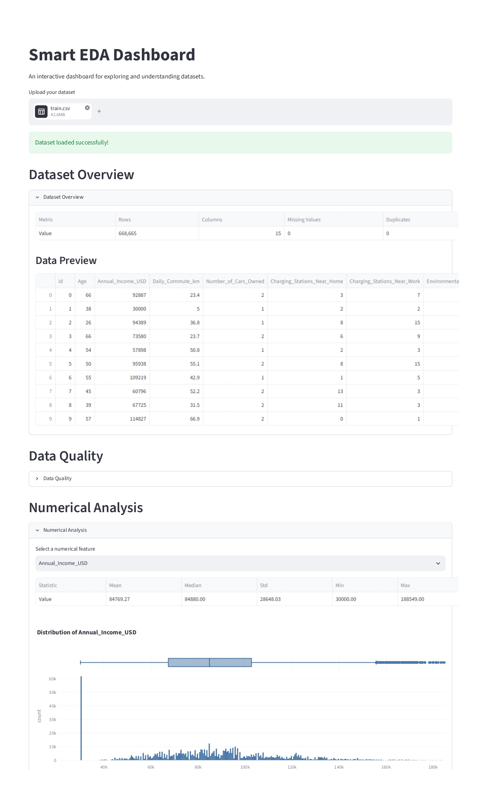

# Smart EDA Dashboard

An interactive Exploratory Data Analysis (EDA) dashboard built with
Streamlit, Pandas, and Plotly.

## Features

- CSV and Excel file upload
- Dataset overview
- Data quality analysis
- Numerical feature analysis
- Categorical feature analysis
- Outlier detection using the IQR method
- Correlation analysis
- Target analysis
- Automatic classification/regression detection
- Interactive Plotly visualizations
- Responsive Streamlit interface

## Tech Stack

- Python
- Streamlit
- Pandas
- Plotly

## Project Structure

```text
smart-eda-dashboard/
│
├── app.py
├── requirements.txt
├── .gitignore
│
└── utils/
    ├── __init__.py
    ├── profiling.py
    └── visualization.py
```

## Installation

Clone the repository:

```bash
git clone git@github.com:parastoof/smart-eda-dashboard.git
cd smart-eda-dashboard
````

Create a virtual environment:

```bash
python -m venv .venv
```

Activate it:

Windows:

```bash
.venv\Scripts\activate
```

Install dependencies:

```bash
pip install -r requirements.txt
```

Run the application:

```bash
streamlit run app.py
```

## Usage

1. Upload a CSV or Excel dataset.
2. Review the dataset overview.
3. Explore data quality.
4. Analyze numerical and categorical features.
5. Inspect outliers.
6. Explore feature correlations.
7. Select a target variable and inspect its distribution.

## Deployment

The application can be deployed using Streamlit Community Cloud.

## Demo

[Live Demo](YOUR_STREAMLIT_APP_URL)

## Screenshot



## License

This project is licensed under the MIT License.
